# UI testing for Windows apps with WinAppDriver - Azure DevOps

[In the first article](UITestingForWindows-Intro.md) we have learned how, thanks to WinAppDriver and Appium, we can perform UI testing against a Windows application. In that article [we have created a sample WPF app](https://github.com/qmatteoq/WpfUiTesting) and then we have tested some basic user interactions, using the local WinAppDriver service running on our machine. However, the most interesting scenario is automating these tests so that, in the context of a CI/CD pipeline, they can be automatically executed every time we commit new code to our repository. [The recently announced integration with Azure DevOps](https://blogs.windows.com/windowsdeveloper/2019/05/13/announcing-ui-tests-in-ci-cd-for-desktop-app-developers/) makes the task easier to implement, since the WinAppDriver service is already up & running on every Windows hosted agent. However, you may find some challenges in implementing the workflow since UI testing is quite different from unit testing and it has different requirements.

Hopefully, this article will help you walking through the implementation of UI Testing for Windows on Azure DevOps. Let's start!

### The basics of CI / CD for MSIX 
This article isn't meant to be a comprehensive guide about Azure DevOps for Windows applications. If you want to understand in details some of the concepts that we will implement in this article, a good starting point is the workshop that the Windows AppConsult team delivered at BUILD about moving Windows app forward, which is available [here](https://github.com/microsoft/AppConsult-WinAppsModernizationWorkshop). Specifically, [Exercise 5](https://github.com/microsoft/AppConsult-WinAppsModernizationWorkshop) will guide you through packaging an application with MSIX and implementing a CI/CD pipeline on Azure DevOps to automatically build and deploy the MSIX package every time you commit some new code to the repository. 
Another great resource is the session that [Ricardo Minguez Pablos](https://twitter.com/ridomin), PM at Microsoft, and [Oren Novotny](https://twitter.com/onovotny), Microsoft MVP, [delivered at BUILD 2019](https://mybuild.techcommunity.microsoft.com/sessions/77012). Here are some important concepts that we will use through the article.

A CI/CD workflow is typically implemented using two different pipelines:

- A **build pipeline**, which takes the source code of the project and builds it. In the context of MSIX packaging, the build pipeline takes care of compiling our Windows application and creating a MSIX package
- A **release pipeline**, which takes the output of the build process, configures it and deploys it on one or more environments (testing, production, etc.). In the context of MSIX packaging, the release pipeline has the responsibility of signing the package and then deploying it using one of the many supported approaches: you can publish to the Microsoft Store, you can leverage Visual Studio App Center for testing, you can deploy on a website, etc.

The signing operation is a very delicate one in this process and the separation of concerns between the build and the release pipeline is very important to prevent identity theft and malicious usages of our certificate, especially if we're signing the application with a public or an enterprise certificate. Why is that? Visual Studio supports signing a package as part of the MSIX generation process, so we might be tempted to use this approach to make things simpler and do everything in the build pipeline. However, in order to do that, we would need to make the private certificate available to the build process, which means committing it to our repository together with the source code. This is a bad practice, especially if you're working as part of a team. This means that every developer who is working on the application will have the chance to get the certificate and use it to sign other applications, even malicious ones, leading to an identity theft.

### The challenges with UI testing
When you start to think about implementing UI testing as part of your CI/CD pipeline for MSIX, you face some challenges compared to a traditional testing scenario. Typically unit testing is included as part of the build pipeline, since tests are executed against the code of your application. However, a MSIX package can't be deployed without being signed and, based on what we have just learned, we can't do the signing operation in the build pipeline.

As such, we need to change a bit the architecture we have seen and split the release pipeline into 2 different stages:

- A stage for the UI testing. This stage will take care of downloading the MSIX package produced by the build pipeline, sign it, install it on the hosted agent and then run the UI tests we have built using WinAppDriver.
- A stage for the actually deploy. This stage will take care of deploying the signed MSIX package to whatever platform we want to use for distribution. This stage will be executed only if the previous one has completed successfully.

In this article we're going to put together all the components which make this architecture possible. I will assume that you already have an Azure DevOps account. If not, you can create one for free on [the official website](https://azure.microsoft.com/en-in/services/devops/). Don't worry! Despite the platform contains "Azure" in the name, it isn't directly tight to an Azure subscription. You can create a free account even without owning an Azure subscription or having to provide a credit card.

Let's start!

### The build pipeline
Let's start to create the build pipeline. Once you're in your project on Azure DevOps, move to the **Pipelines -> Builds** section and choose the option to create a new one.
As first step, you will have to choose the repository where your code is hosted. This is the repository which contains our whole solution, which includes both the WPF application and the tests. It's the one we have built on the previous post, which is available [here](https://github.com/qmatteoq/WpfUiTesting) for your reference.
Then you will be asked to choose a starting template. 

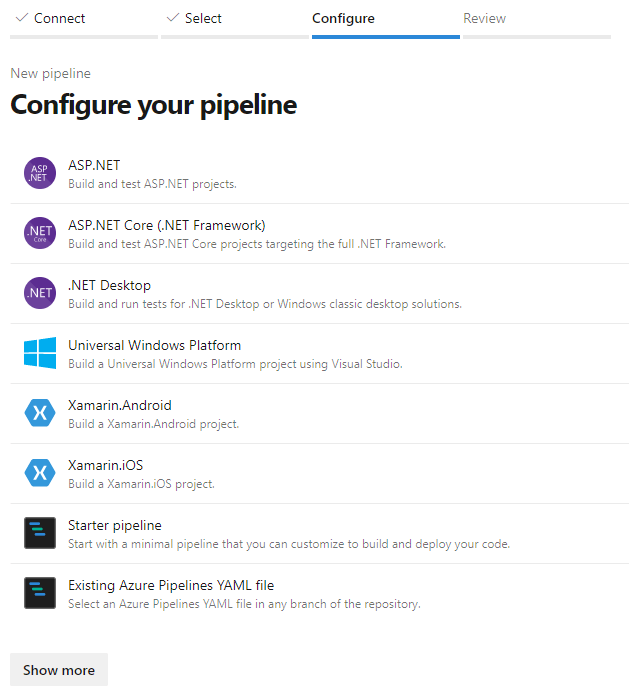

The best one for our scenario is **Universal Windows Platform**, since it will contain all the steps to create a MSIX package, regardless if it's a pure UWP app or a Win32 app packaged with the Windows Application Packaging Project, like our scenario. The option will create a template based on YAML, which is a markup language used to enable the **Infrastructure as code** approach, where the pipeline is created through a definition file rather than manual processes. This way, the definition of the pipeline can be treated like any other file of the project, which is included in the repository and evolves with your code as the requirements change.
This is how the default template looks like:

```yaml
# Universal Windows Platform
# Build a Universal Windows Platform project using Visual Studio.
# Add steps that test and distribute an app, save build artifacts, and more:
# https://aka.ms/yaml

trigger:
- master

pool:
  vmImage: 'windows-latest'

variables:
  solution: '**/*.sln'
  buildPlatform: 'x86|x64|ARM'
  buildConfiguration: 'Release'
  appxPackageDir: '$(build.artifactStagingDirectory)\AppxPackages\\'

steps:
- task: NuGetToolInstaller@1

- task: NuGetCommand@2
  inputs:
    restoreSolution: '$(solution)'

- task: VSBuild@1
  inputs:
    platform: 'x86'
    solution: '$(solution)'
    configuration: '$(buildConfiguration)'
    msbuildArgs: '/p:AppxBundlePlatforms="$(buildPlatform)" /p:AppxPackageDir="$(appxPackageDir)" /p:AppxBundle=Always /p:UapAppxPackageBuildMode=StoreUpload'
```

This template is a good starting point, but it lacks some important tasks, like publishing the actual output (the MSIX package) so that it can be picked up by the release pipeline.

Let's do a few tweaks:

```yaml
trigger:
- master

pool:
  vmImage: 'windows-latest'

variables:
  buildPlatform: 'x86'
  buildConfiguration: 'Release'
  appxPackageDir: '$(build.artifactStagingDirectory)\AppxPackages\\'

steps:
- task: VSBuild@1
  inputs:
    platform: '$(buildPlatform)'
    solution: '**/*.sln'
    configuration: '$(buildConfiguration)'
    msbuildArgs: '/restore /p:AppxBundlePlatforms="$(buildPlatform)" /p:AppxPackageDir="$(appxPackageDir)" /p:AppxBundle=Always /p:UapAppxPackageBuildMode=SideloadOnly /p:AppxPackageSigningEnabled=false'

- task: PublishBuildArtifacts@1
  displayName: 'Publish artifact: drop'
  inputs:
    PathtoPublish: '$(appxPackageDir)'
  condition: succeededOrFailed()
```

Here is the list of changes we have done:
1) We have reduced the number of supported build platforms, since some of the default ones aren't suitable for a WPF application, like ARM. As such, we have set the variable **buildPlatform** to x86 only.
2) We have removed the tasks to install NuGet and restore the packages. A separate task, in fact, isn't needed anymore, since Visual Studio can do it on its own. We just have to add the **/restore** parameter to the build arguments, which are specified in the **msbuildArgs** property of the **VSBuild@1** task.
3) In my scenario, I'm planning to deploy the application on an Azure website using the [App Installer technology](https://docs.microsoft.com/en-us/windows/msix/app-installer/app-installer-root) instead of using the Microsoft Store. As such, I've set the **/p:UapAppxPackageBuildMode** parameter to **SideloadOnly**. This way, Visual Studio will generate only the .msix / .msixbundle files and not the .msixupload one, which is only for the Store.
4) We've set the **/p:AppxPackageSigningEnabled** parameter to **false**, since we don't want to do the signing as part of the build process.
5) We've added a task to publish the artifacts (the MSIX package) in a folder hosted on Azure DevOps called **drop**. This way, the release pipeline will be able to pick the generated MSIX package.

However, it isn't enough. We need to do a few additional things to properly support the MSIX / UI testing scenario.

#### Setting the MSIX package version
When you build a MSIX package using a CI/CD approach, an important requirement is to update the version number in the manifest every time a new package is created. If you rely on a manual approach (e.g.: changing the version in the manifest before committing the new code) you open the door to many potential problems. It's enough to forget to change the version to trigger the release of a new package with the same version number as the previous one, breaking the update chain.
The easiest way to do it is by leveraging a 3rd party extension available on the Azure DevOps Marketplace, called [Manifest Versioning Build Tasks](https://marketplace.visualstudio.com/items?itemName=richardfennellBM.BM-VSTS-Versioning-Task) by Richard Fennel. Once you have installed it on your Azure DevOps account, you can just add the following step in the YAML before the one which performs the build:

```yaml
- task: VersionAPPX@2
  displayName: 'Version MSIX'
```

However this isn't enough. This task, in fact, takes care of setting a version number based on the build number generated by Azure DevOps which, by default, has the following syntax:

```text
$(date:yyyyMMdd)$(rev:.r)
```

This expression is translated with a number like 20190205.1. The problem is that this syntax isn't suitable for a MSIX package, since the manifest requires a version number with the expression **x.y.z.0** (for example, 1.2.5.0). As such, we need to change the default version number, by adding the following entry before the **steps** section of the YAML file:

```yaml
name: $(date:yyyy).$(Month)$(rev:.r).0
```

This way, at every build, Azure DevOps will generate a build number like 2019.2.1.0, which is perfect for MSIX versioning. 

#### Publish the tests library
The changes we have made so far would have been required by any CI/CD pipeline implementation for MSIX. The following one, instead, is specific to our scenario, where the solution contains also UI tests.
When we move the testing session from the build pipeline to the release pipeline, we hit an issue. In order to run the tests, we need to compile the project which contains the tests, so that we can get a DLL which contains our test class. However, since we are in the release pipeline, we don't have access anymore to the source code of the project, but only to the artifacts published by the build pipeline. As such, other than publishing the MSIX package as an artifact, we need also to publish the DLL (plus its dependencies) which contains our test suite so that the test runner can pick it.

To do this, we can add, as final step, another task to publish a build artifact:

```yaml
- task: PublishBuildArtifacts@1
  inputs:
    PathtoPublish: 'WpfUiTesting.Tests\bin\Release\'
    ArtifactName: 'tests'
  condition: succeededOrFailed()
```

We're going to create a new artifact, called **tests**, where we're going to store the compilation output of the test project (**WpfUiTesting.Tests**).

#### The full YAML
This is the final YAML file after all our changes:

```yaml
trigger:
- master

pool:
  vmImage: 'windows-latest'

variables:
  buildPlatform: 'x86'
  buildConfiguration: 'Release'
  appxPackageDir: '$(build.artifactStagingDirectory)\AppxPackages\\'

name: $(date:yyyy).$(Month)$(rev:.r).0

steps:
- task: VersionAPPX@2
  displayName: 'Version MSIX'

- task: VSBuild@1
  inputs:
    platform: '$(buildPlatform)'
    solution: '**/*.sln'
    configuration: '$(buildConfiguration)'
    msbuildArgs: '/restore /p:AppxBundlePlatforms="$(buildPlatform)" /p:AppxPackageDir="$(appxPackageDir)" /p:AppxBundle=Always /p:UapAppxPackageBuildMode=SideloadOnly /p:AppxPackageSigningEnabled=false'

- task: PublishBuildArtifacts@1
  displayName: 'Publish artifact: drop'
  inputs:
    PathtoPublish: '$(appxPackageDir)'
  condition: succeededOrFailed()

- task: PublishBuildArtifacts@1
  inputs:
    PathtoPublish: 'WpfUiTesting.Tests\bin\Release\'
    ArtifactName: 'tests'
  condition: succeededOrFailed()
```

If we now run the build (saving the YAML file will be enough to trigger a new execution) and everything goes well, at the end of the process we should get two artifacts:

- A folder called **drop**, which contains the unsigned MSIX package.
- A folder called **tests**, which contains the DLL with our tests, plus all the testing dependencies like MSTest or the Appium SDK

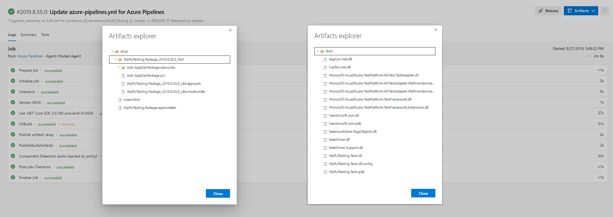

Now it's time to build our release pipeline!

### The release pipeline - The UI testing stage
As mentioned in the beginning of the article, our pipeline will be made by two different stages. In this section, we're going to focus on the one which performs the UI testing. Only if the tests are all green, we'll move to the next stage to do the actual deployment.

Go back to the Azure DevOps dashboard of your project and move to **Pipelines -> Releases** and create a new one.
As first step, you will be asked to choose one of the available templates. Choose **Empty job**, since we're going to start from scratch:


Give to the stage a meaningful name (for example, **UI testing**), then close the panel. You should see a screen like the following one:

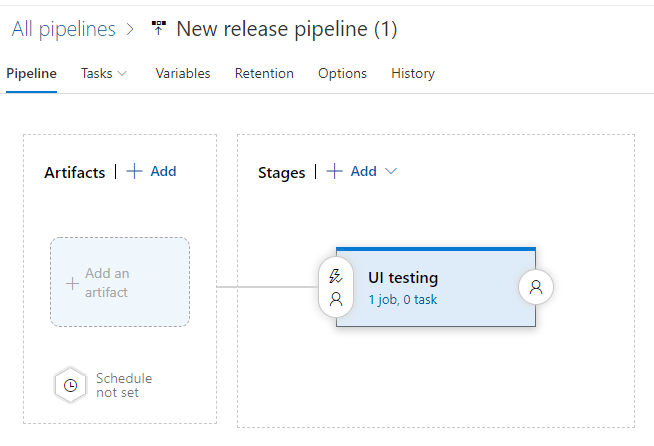

As first step, let's add an artifact, so that the various stages we're going to build can access to the output of the build pipeline we have previously built. Click on the **Add an artifact** box and choose, in the **Source (build pipeline)** field, the name of the build pipeline we have previously built. Feel free to keep all the default options that will be filled.

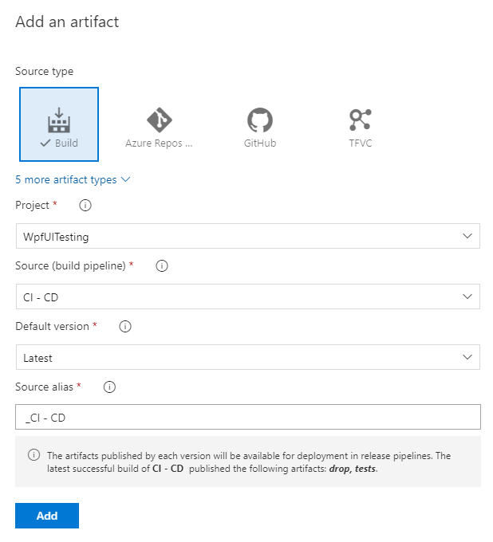

Now click on the lighting icon on the artifact and set the **Continous deloyment trigger** switch to **Enabled**.

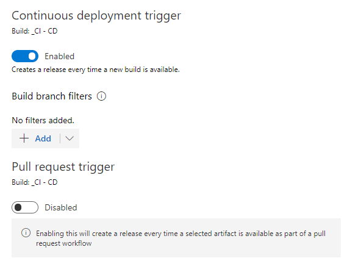

Thanks to this option, every time the build pipeline will complete successfully, the release pipeline will be automatically triggered. Once you're back to the pipeline overview, click on the **1 job, 0 task** link under the stage name:

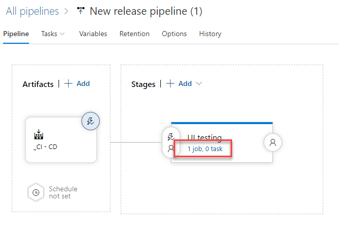

We will get access to the deployment process, where we're going to specify all the steps we want to perform. It's similar to what we did with the build pipeline, the only difference is that the release pipeline creation is UI based, so we won't write YAML this time.
First click on **Agent job** and change the **Azure Specification** dropdown to **windows-2019**. We want to use the most recent version of Windows and Visual Studio.
Now click on the + button near the **Agent job** to start adding the various tasks we're going to perform. This is the flow we're going to implement:

1) We're going to sign the MSIX package produced by the build pipeline.
2) We're going to install it on the Windows hosted agent which is running the pipeline.
3) We're going to launch WinAppDriver and run the tests.

Let's start!

#### The code signing
The easiest way to sign your MSIX package is by using a 3rd party extension developed by Stefan Kert, which is available on the [Marketplace](https://marketplace.visualstudio.com/items?itemName=stefankert.codesigning). Once you have installed it on your account, you can add a **Code signing** task which, under the hood, will use [the signtool utility](https://docs.microsoft.com/en-us/windows/win32/appxpkg/how-to-sign-a-package-using-signtool) to sign the package with the certificate you have provided. The bonus of this extension is that it uses [Secure Files](https://docs.microsoft.com/en-us/azure/devops/pipelines/library/secure-files?view=azure-devops) to store the certificate. This means that you will be able to use it inside a pipeline, but you won't be able to download it or copy somewhere else. Even if you give access to the pipeline to someone else, they won't be able to reuse your certificate to sign other applications.

There are three important fields to edit in the settings:

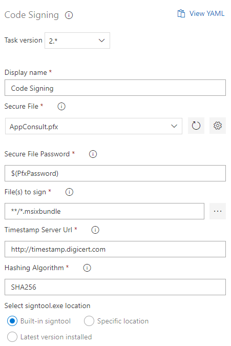

1) In the **Secure File** field choose the PFX file which contains the certificate you want to use to sign the MSIX package. You can click on the settings icon near the field to upload a new one. Remember that, as per guidelines, the subject of the certificate must match the publisher name in the manifest, otherwise the signing operation will fail.
2) In the **Secure File Password** field you need to specify the certificate's password. Instead of adding it here in clear, it's better to create a new variable and define it later. In my case, I've created a variable called **$(PfxPassword)**.
3) In the **File()s to sign** field you need to specify which file (or files) you want to sign. In our case, we want to sign the file with .msixbundle extension that will be produced by the build pipeline. Since there will be only one, we can just use the expression ****/*.msibundle** to sign all the files with this extension included in any artifacts folder.

After you have saved the task, you can click on the **Variables** tab in the pipeline to store the password. Just add a new item with the same name you have chosen in the task (**PfxPassword**, in my case) and, as value, the password. For extra security, click on the lock icon near the value so that it will be masked.

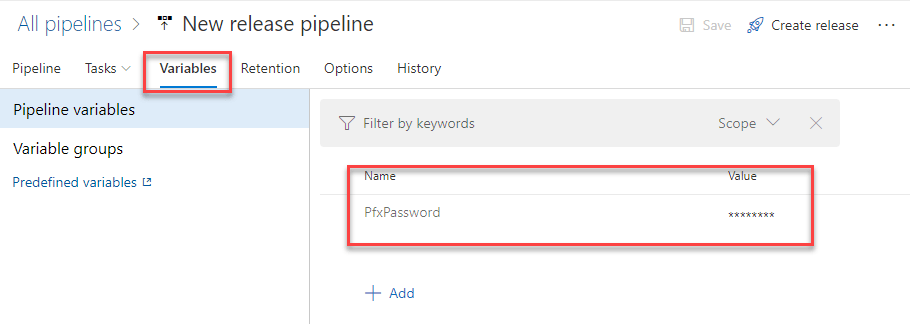

#### Download and install the certificate
This step is required only if you're signing your application with a certificate which hasn't been released by a public certification authority, but it's an internal enterprise or self-signing certificate. In the first scenario, in fact, being released by a public CA, it will be already trusted by Windows and, as such, you can directly proceed to install the application on the hosted agent.

If this isn't your scenario, then, we need to make the certificate trusted by the hosted agent before sideloading the MSIX package, otherwise the operation will fail. The first step is to download the certificate on the machine. For this purpose, we can use the **Download secure file** task:

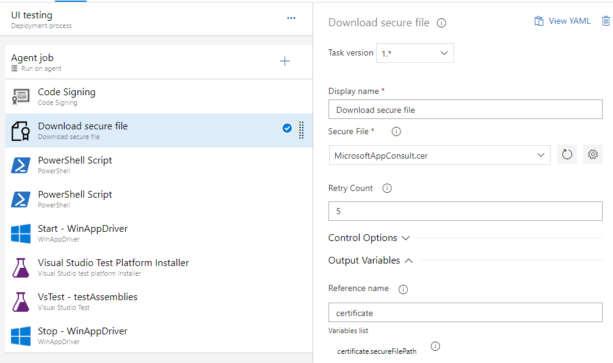

There are two important things to configure here:

1) In the **Secure File** field you must choose (or upload, if you haven't done already) the public certificate which is associated to the private certificate you have used in the previous task to sign the package (the file with .cer extension).
2) In the **Reference name** field, you need to assign a name to the file. This way, the certificate will be accessible by the pipeline using the variable **$(xyz.secureFilePath)**, where **xyz** is the name you have assigned. In my case, it will be **$(certificate.secureFilePath)**.

The next step is to add a PowerShell script that will take care of installing this certificate on the hosted agent. Click again on the + sign near the **Agent job** and add a task of type **PowerShell script**.

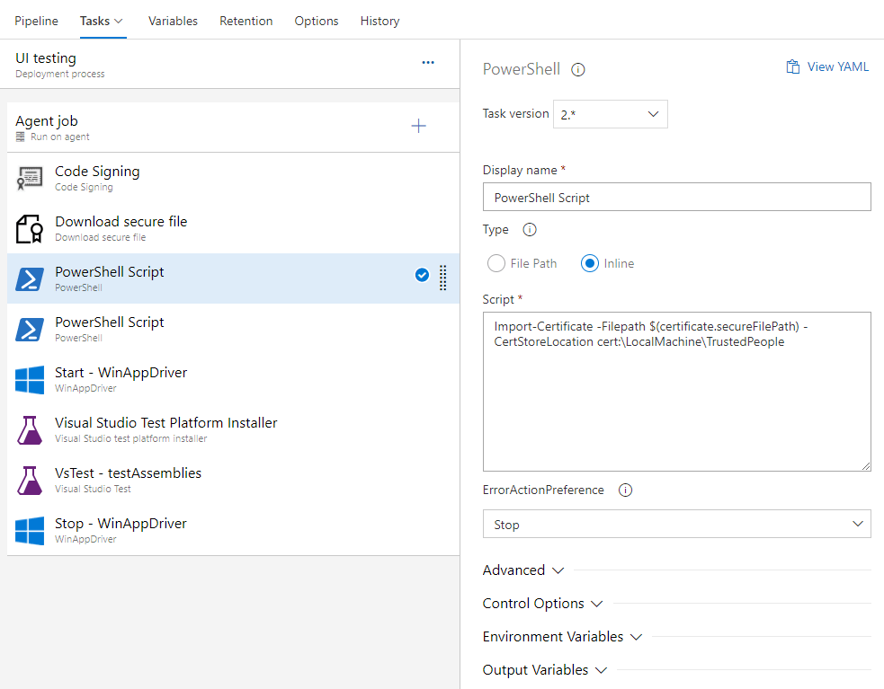

Choose **Inline** and copy and paste the following script:

```powershell
Import-Certificate -Filepath $(certificate.secureFilePath) -CertStoreLocation cert:\LocalMachine\TrustedPeople
```

We're using the **Import-Certificate** command to import the certificate we have just uploaded as secure file to the **Trusted People** store.

#### Install the MSIX package
To install the MSIX package we need to add another **PowerShell Script** task, which will use the **Add-AppPackage** command followed by the file name. However, in our scenario we don't have a fixed name, since Visual Studio generates MSIX packages using, as name, the convention **app name_version_CPU architecture** (for example, **WpfUiTesting.Package_2019.2.1.0_x86**). Since the name includes the version, it will change at every build. To workaround this problem we can replace the version number in the file name with the variable **$(Build.BuildNumber)**, which will be replaced by the current build number.

This is an example of the script to install the package:

```powershell
Add-AppPackage -Path "WpfUiTesting.Package_$(Build.BuildNumber)_x86.msixbundle"
```

In order for the task to find the package, you need to expand the **Advanced** section and set the **Working Directory** to the folder where the build artifact is copied, like:

```powershell
$(System.DefaultWorkingDirectory)/_CI - CD/drop/WpfUiTesting.Package_$(Build.BuildNumber)_Test
```

In my scenario, **_CI - CD** is the name of the build pipeline, while **WpfUiTesting.Package** is the name of the packaged version of my WPF app. You can click on the three dots near the field if you want to explore the folder with the artifacts, so that you can find the right one. Just remember to replace the fixed version number with the the build number's variable, since the folder name generated by Visual Studio includes it as well.

> Important! At the time of writing, the Windows hosted agents are based on Windows 10 1809. As such, if you want to install the MSIX package, you need to target Windows 1809 (SDK 17763) as minimum supported SDK. An application which supports only Windows 10 1903 and above won't work.

#### Perform the UI tests
Now that the MSIX application is installed on the hosted agent, we can finally run the UI tests. As first step, we need to run the WinAppDriver service, otherwise the Appium SDK won't be able to launch and interact with the application. As already mentioned, WinAppDriver is already installed on the hosted agent, so we just need to start it using one of the available tasks called **WinAppDriver**.
Once we have added it to our pipeline, all we need to do is to choose which kind of command we want to execute, in this case **Start WinAppDriver**.

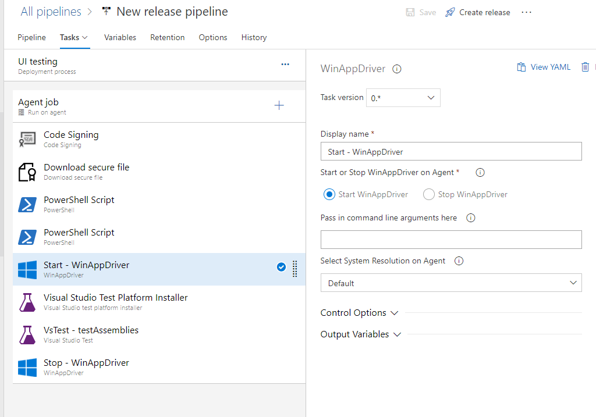

Now we're ready to start our tests, by adding a new task of type **Visual Studio test**:

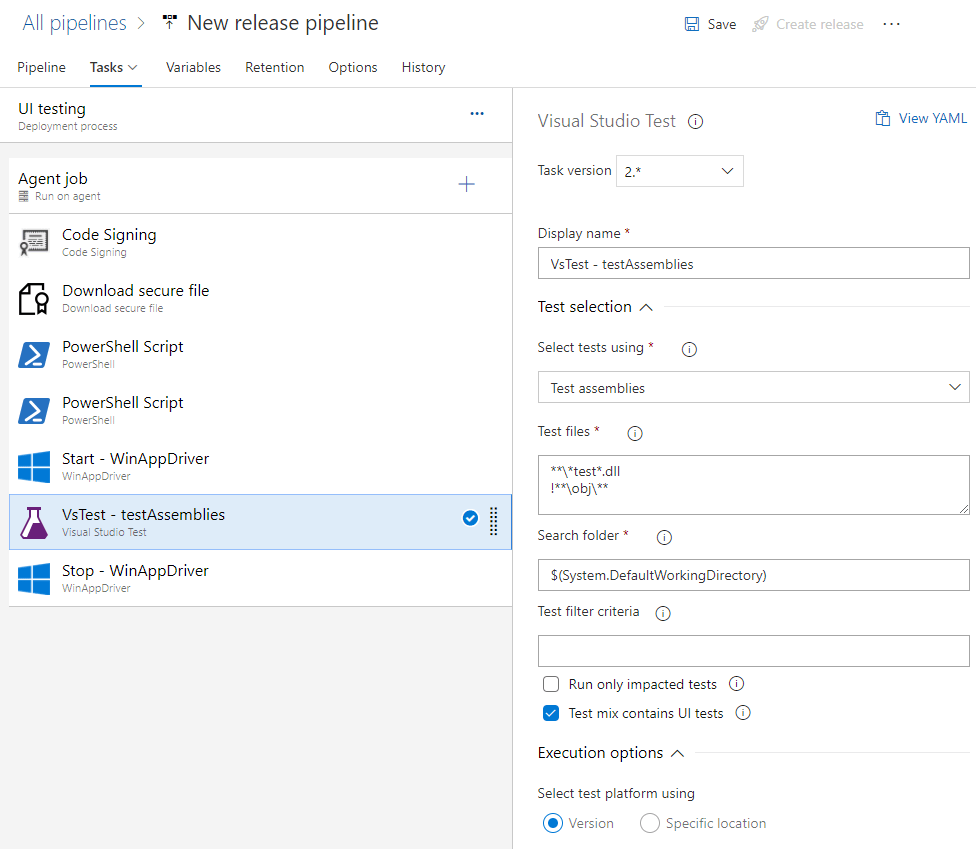

The task will pick up the DLL we have produced in the build pipeline and stored in the **tests** folder. We just need to specify the search criteria in the **Test files** field. The easiest way is to use pattern matching. For example, in my sample project the test suite is called **WpfUiTesting.Tests**, so I've used the **\*test\*.dll** pattern to look for all the DLLs in the folder which contain the **test** keyword.
This task, under the hood, will leverage a process called **Vstest.console**, which is a console-based test runner included in Visual Studio.

The last step is to stop WinAppDriver once we have completed the testing. We just need to again the WinAppDriver task but, this time, we need to choose **Stop WinAppDriver** as action.

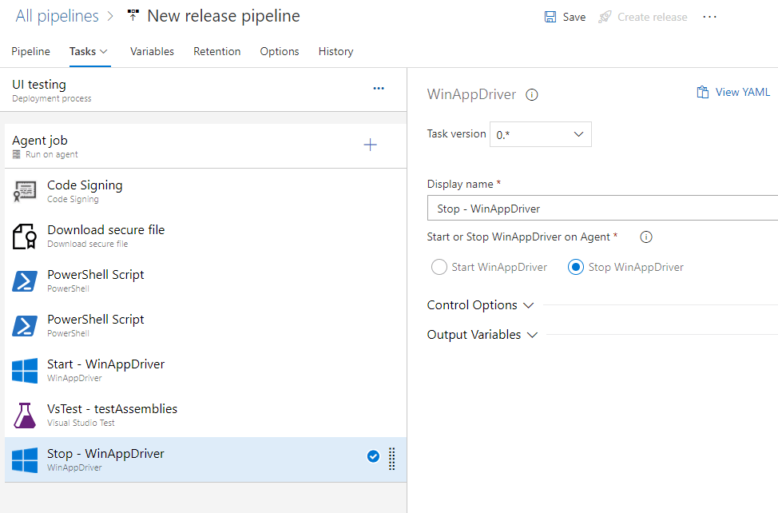

#### Running the release pipeline
That's it! Now you can test the release pipeline, either by manually clicking the **Create release** button or by committing new code to the repository which, due to the CI/CD configuration, will trigger a new build followed by a new release. 
During the execution of the release pipeline, the test will be executed and the same "voodoo magic" that we have seen on our PC will happen also on the hosted agent: the application will be launched and the interactions we have specified using the Appium SDK will be triggered. Of course, we won't actually see the test happening, since we don't have a visual connection to the hosted agent (like a remote session). However, we'll be able to follow the various tasks using the Azure DevOps log. At the end of the execution, the pipeline will succeed or fail based on the outcome of the test suite. Regardless, you will be able to see the details about the tests in the dashboard:

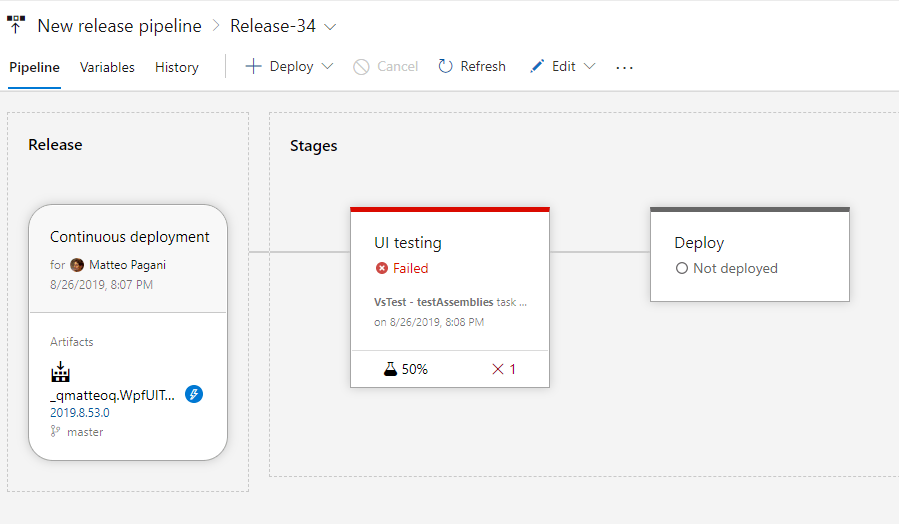

In the above screenshot, for example, you can see that the testing session has failed: 1 test didn't pass, which accounts for 50% of the whole test suite. If we click on it, we can see all the details we need to understand why the test has failed. As you can see in the screenshot below, these are the same information that Visual Studio was reporting us through Test Explorer on our local machine:


### The release pipeline - The deploy
Now that we have our UI testing stage up & running, we can add a new stage to perform the actual deploy.

> This stage is the same standard one you would do for any MSIX packaged application, regardless if you apply UI testing or not.

Just go back to the edit mode of the release pipeline, choose **Add -> New stage** and give it a meaningful name (like **Deploy**). Then click again on the label **1 job, 0 tasks** to start adding the tasks that will need to be performed.
The only fixed task to add here is the code signing one, which is the exact same one we have added in the UI testing stage. Every stage, in fact, starts from the artifacts published by the build pipeline, so the starting point is again an unsigned MSIX package. Before deploying it, we need to sign it. I won't repeat the steps, since we need to use the same exact configuration we have used in the UI testing stage.

The next step is to add a task which does the actual deployment. I won't provide step by step instructions here, because it all depends by which is your deployment scenario:

- If you're publishing on the Store, you can use the task called **Windows Store - Publish**, which will use the Store APIs to do an automatic submission. You will be asked to add, as service endpoint, your connection with your Partner Center account, followed by all the information about the app, like the app id.
- If you're using sideloading and App Installer, you can deploy to Azure using the **Azure File Copy** task (if you want to use the static website feature offered by Azure Storage and blobs) or the **Azure App Service Deploy** one (in case you want to host the package using a full website). Or, if you aren't using Azure, you can use the generic **FTP Upload** task to upload the package to any hosting.
- If you're deploying the application to a small set of testers, you can use Visual Studio App Center by leveraging the **App Center distribute** task.

For example, in my scenario I'm deploying the WPF application to a blob storage on Azure, so this is how my deploy stage looks like:

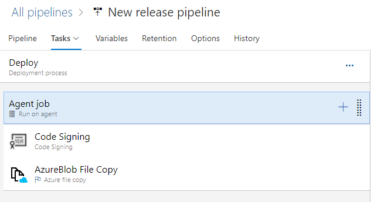

At the end of the process, the whole release pipeline should look like this:

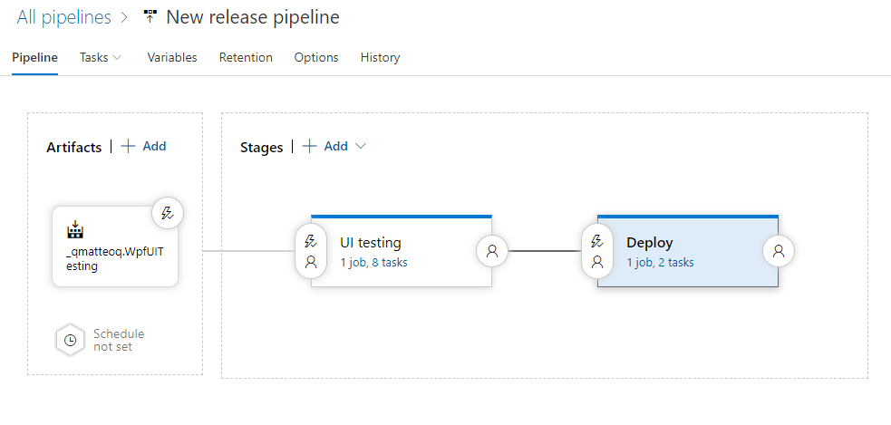

Since the **Deploy** stage is defined after the **UI Testing** one, the actual deploy will be performed only if all the tests are passing. If any of the test should fail, the whole UI testing stage will fail, meaning that the deploy one won't be executed. Smart, isn't it?

### Wrapping up
It's been a long journey! But we have achieved our goal: we have integrated UI testing for our WPF application inside a CI/CD pipeline on Azure DevOps. From now on, every time we're going to commit new code to the repository, the following actions will happen:

- A build pipeline will compile the main application and package it as MSIX. At the same time, also the UI tests will be compiled in a dedicated DLL.
- The first stage of the release pipeline will download the generated MSIX package, it will sign it and it will install it on the hosted agent. Then, it will execute the UI tests, thanks to the WinAppDriver service being pre installed on all the Windows based hosted agents.
- If all the tests are green, the release pipeline will move to the second stage: the MSIX package will be downloaded again, signed and then deployed to your platform of choice (Store, Visual Studio App Center, website, etc.).

This workflow will ensure that the quality bar is always met and the whole test suite is executed every time we make any change to the source code, no matter how small or big.

As a reminder, you can find the full source code of the sample project, including the YAML file for the build pipeline, [on GitHub](https://github.com/qmatteoq/WpfUiTesting).


